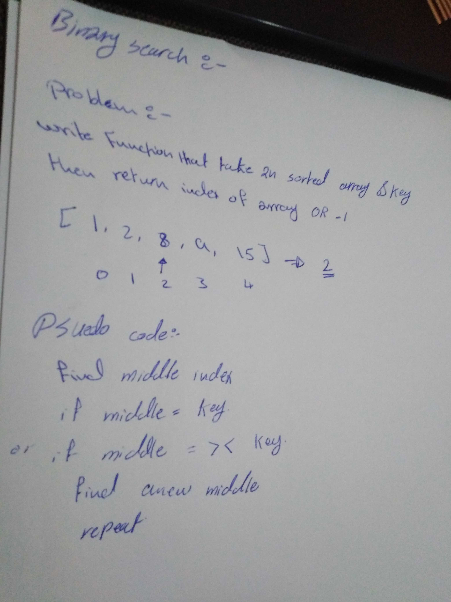

# Binary Search
A function binary search

## Challenge
 write a function that given a sorted array and a key,get index of the array value that matches the key.

## Approach & Efficiency
1-cut the array in half each time testing to see if the key matched the value of the middle position.

2-If it was too big, i ran a function that cut the array in half again on the top half.
 
3-If it was too small, i cut the array in half again on the end.

4-  repeated this process until i found the index value of the key.

## Solution
