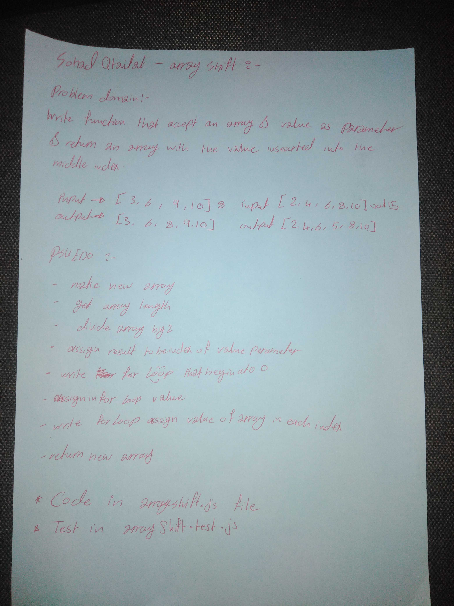

# Insert and shift middle index of array

## Challenge
write a function that given and array and a value
inserts that value into the middle of the array. 

*****It should return an array with the value in the middle index position

## Approach & Efficiency

1) determine the middle index by dividing the length of the array

2) loop through the first half of the array 

3) assign the centerIdx value the value given in the arrayNew

4) loop through the second part of the array = values to the new array 

## Solution
